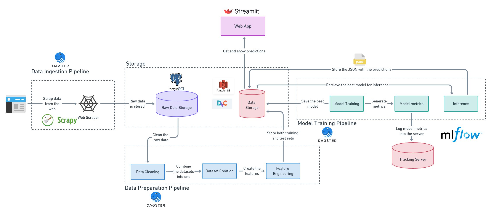

# Spanish-LaLiga-Prediction

This projects represents the entire infrastructure to predict the outcome of the Spanish soccer league LaLiga. It includes all the stages of the ML lifecycle, from data ingestion to inference.

It intends to provide reliable predictions. The system performance is measured using a test set. The most recent model metrics are the following:

| Train Accuracy (%) | Validation Accuracy (%) | Test Accuracy (%)  |
| :------------------| :-----------------------| :------------------|
|        51.6        |          50.6           |        51.2        |

Click [here](http://ec2-34-245-186-212.eu-west-1.compute.amazonaws.com:8501/) to visit the web app and see a demo of the predictions.




## Tools
This section describes the tech stack used for the development and the deployment of the system:

- **Dagster**: Used as a workflow orchestration tool for the Data Ingestion pipeline, Data Preparation pipeline, and the Model training pipeline
- **Scrapy**: Used to scrape the data from the web
- **PostgreSQL**: Used to store the data in its raw form
- **Amazon S3 and DVC**: Data versioning in the cloud. We store in the same repository the data, the training pipeline, and the model.
- **MLflow:** Used to keep track of the model training experiments.
- **Streamlit:** Used to create a web app to show a demo of the project.

## Environment Variables
The system needs the following environment variables to be defined to work appropriately.

| Environment Variables |
| :-------------------- |
| AWS_ACCESS_KEY_ID     |
| AWS_SECRET_ACCESS_KEY |
| AWS_BUCKET            |
| AWS_REGION            |
| DB_HOST               |
| DB_PASSWORD           |
| DB_USER               |

## Docker

There is a `docker-compose.yml` file that defines the services for the web app, the postgres database and the MLflow tracking server. Actually it is running on an Amazon EC2 instance.

The following command will build and start all the services.

```bash
docker-compose up -d --build
```

## Workflows
At the moment the workflows are defined in GitHub Actions. On the other hand the pipelines can be started manually with the following commands:

**Data ingestion pipeline**
```bash
python -m src.dagster_pipeline.data_ingestion_pipeline
```

**Data preparation pipeline**
```bash
python -m src.dagster_pipeline.data_preparation_pipeline
```

**Model training pipeline**
```bash
python -m src.dagster_pipeline.train_pipeline
```

**Inference pipeline**
```bash
python -m src.dagster_pipeline.predict_pipeline
```
## To Do

- [ ] Automate the pipeline to be started when new the web page is updated with a new match outcome
- [ ] Create other features in order to improve the results
- [ ] Integrate soccer leagues from other countries
- [ ] ...

